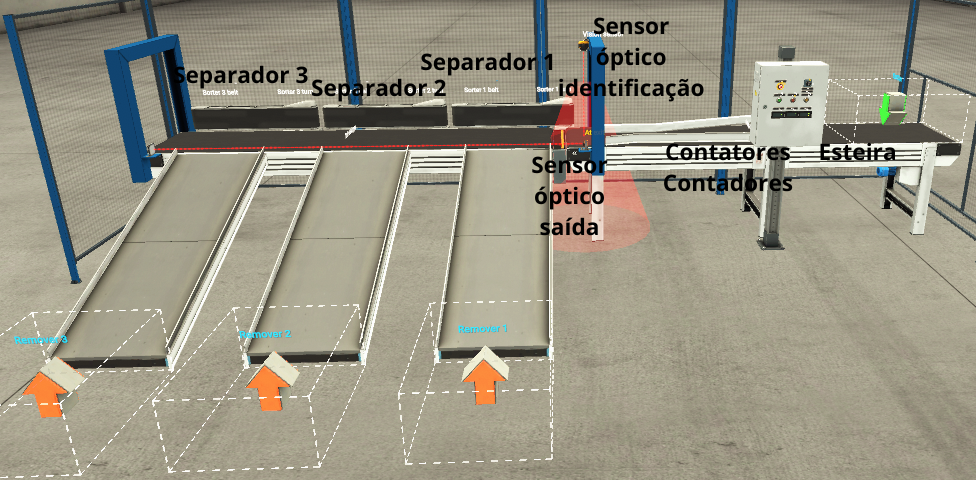
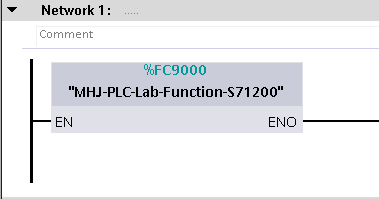
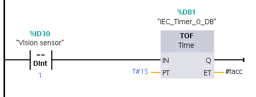
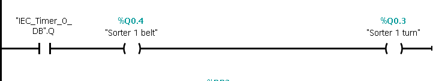
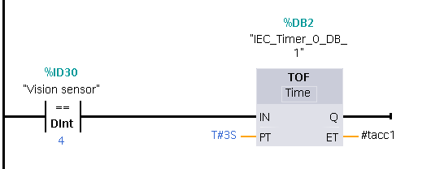
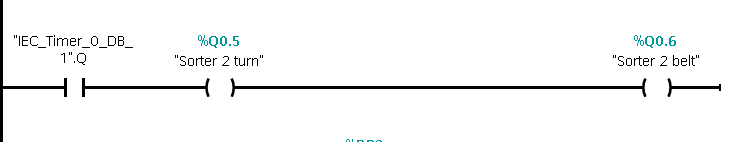
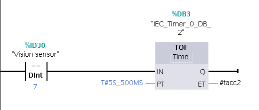
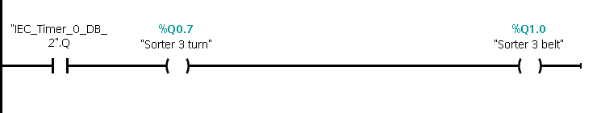

## Projeto de Automação Industrial
## Instituto de Computação - Universidade Federal de Alagoas

- João Arthur Gaia

- José Augusto Santos

## Indice

- [Descrição](#descrição)
- [Esquemática](#esquemática)
- [Tabelas de Endereçamento](#tabelas-de-endereçamento)
- [Descrições Lógicas](#descrições-lógicas)
- [Tabelas da Verdade](#tabelas-da-verdade)
- [Código Ladder no CLP](#código-ladder-no-clp)
- [Como rodar](#como-rodar)

## Descrição
A ideia do projeto é automatizar a separação de objetos automaticamente, utilizando uma cena de triagem de objetos do Factory IO. Os objetos entram na esteira principal, passam pelo sensor ótico, que identifica a classe do objeto, e os separadores atuam, de acordo com a classe do objeto, para os separar corretamente, baseado numa lógica programada em Ladder no simulador de CLP fornecido pelo TIA Portal v17.

## Esquemática

## Tabelas de Endereçamento

A tabela de endereçamento foi construida baseada nos endereços fornecidos pelos sensores e aturadores do Factory IO, abaixo é mostrado os endereços em forma de tabela:

|   Nome            |   Endereço   | Tipo da variável |
| ----------------- | ------------ | ---------------- |
| At exit           | %10.0        | BOOL             |
| Start             | %10.1        | BOOL             |
| Reset             | %10.2        | BOOL             |
| Stop              | %10.3        | BOOL             |
| Emergency stop    | %10.4        | BOOL             |
| Vision Sensor     | %ID30        | DWORD            |
| Entry conveyor    | %Q0.0        | BOOL             |
| Exit conveyor     | %Q0.2        | BOOL             |
| Sorter 1 turn     | %Q0.3        | BOOL             |
| Sorter 1 belt     | %Q0.4        | BOOL             |
| Sorter 2 turn     | %Q0.5        | BOOL             |
| Sorter 2 belt     | %Q0.6        | BOOL             |
| Sorter 3 turn     | %Q0.7        | BOOL             |
| Sorter 3 belt     | %Q1.0        | BOOL             |
| Counter 1         | %QD30        | DWORD            |
| Counter 2         | %QD34        | DWORD            |
| Counter 3         | %QD38        | DWORD            |

## Descrições Lógicas

|   Nome            |   Descrição  |
| ----------------- | ------------ |
| At exit           | Sensor que detecta quando um objeto passa para as rampas |
| Start             | Botão de início |
| Reset             | Botão de re-início |
| Stop              | Botão de parada do processo |
| Emergency stop    | Botão de emergência para parar o processo. Também usado para iniciar o processo |
| Vision Sensor     | Sensor óptico detecta/identifica objetos. Usado para separar os objetos |
| Entry conveyor    | Esteira utilizada para transportar os objetos até o sensor óptico |
| Exit conveyor     | Esteira que contêm os separadores |
| Sorter 1 turn     | Separador do primeiro tipo |
| Sorter 1 belt     | Correia do separador do primeiro tipo |
| Sorter 2 turn     | Separador do segundo tipo |
| Sorter 2 belt     | Correia do separador do segundo tipo |
| Sorter 3 turn     | Separador do terceiro tipo |
| Sorter 3 belt     | Correia do separador do terceiro tipo |
| Counter 1         | Contador do primeiro tipo |
| Counter 2         | Contador do primeiro tipo |
| Counter 3         | Contador do primeiro tipo |

## Tabelas da Verdade

todo

## Código Ladder no CLP
Ladder responsável pela conexão entre o TIA Portal v17 e o Factory IO

todo

todo

todo

todo

todo

todo

todo

## Como rodar

* Primeiro, abra a cena do Factory IO, vá em `FILE->Drivers`. Confirme se o driver é `Siemens S7-PLCSIM`:

* Segundo, vá em `CONFIGURATION` e confirme se o modelo selecionado é o `S7-1200`:

* Abra o TIA Portal V17 e abra o projeto `.ap17`, em seguida inicie a simulação e estabeleça conexão:

* Carregue o programa:

* Aperte em `RUN` no simulador:

* No Factory IO clique em `CONNECT` e espere a conexão se efetuar:

* Volte para a cena e aperte play:

* Vá até o quadro de comandos, aperte `Emergency Stop` e `Start`:

* A planta entrará em funcionamento:

